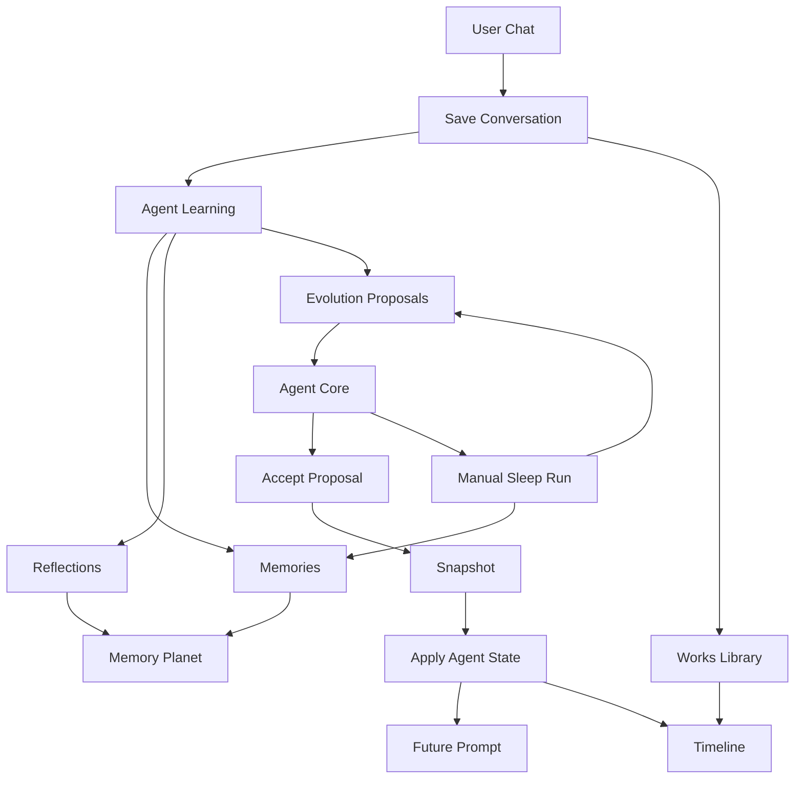

# Agent Autonomy Governance Design

日期：2026-05-17

## 定位

本阶段把项目从“可见的智能体”推进到“可运行、可治理、可持续成长的智能体”。

当前系统已经完成：

- 一把钥匙对应一个智能体边界。
- 聊天、媒体、设计、记忆都按钥匙隔离。
- 聊天后会生成记忆、反思、进化提案。
- `AgentCorePanel` 展示当前状态、最近反思、待确认进化、历史。
- `MemoryPlanetPanel` 把记忆、反思、提案可视化。

下一阶段不追求更多装饰。核心是让智能体的学习、思考、作品和公开宇宙都有清晰状态、来源、权限和回滚边界。

一句话定义：

每把钥匙里的智能体会低频自主思考，会整理记忆，会把确认后的进化应用到真实回复和创作里，并把成长过程沉淀成作品库、时间线和可选公开的星球名片。

## 设计原则

- 自主思考必须受控，不能无限循环。
- 学习可以自动发生，改变人格和公开内容必须用户确认。
- 每条记忆必须能追溯来源。
- 每次进化必须能解释影响。
- 私密数据默认不公开。
- 公开宇宙只能使用用户显式允许的展示数据。
- 先做同步 MVP，不引入后台队列和定时任务。

## 6 个模块

### 1. 智能体睡眠周期

睡眠周期是受控的自主思考。

它不是模型持续自运行。它是一次明确的整理任务。

触发方式：

- 聊天结束后，如果距离上次睡眠超过阈值，只标记“可睡眠”，不阻塞回复。
- 用户在 Agent Core 中点击“让它想一会儿”。
- 用户每天首次进入 `/chat` 时，如果有新内容，可提示执行。

第一版只做手动触发。自动触发只保存 `nextSleepAt`，不自动调用模型。

睡眠产物：

- `dailySummary`：这段时间发生了什么。
- `memoryActions`：建议确认、合并、降权、遗忘哪些记忆。
- `evolutionProposals`：建议调整语气、关系定位、内容策略、页面设计。
- `workIdeas`：基于记忆可生成的作品想法。
- `nextConversationHints`：下一次对话可承接的线索。

用户看到的是“思考报告”，不是模型过程。

### 2. 记忆治理系统

当前记忆能生成，但缺少治理。

记忆治理要回答：

- 它为什么记住这件事。
- 来源是哪次对话或附件。
- 置信度是多少。
- 是否已经被用户确认。
- 是否影响过回复。
- 是否应该降权、合并、归档或拒绝。

记忆状态沿用现有 `active | archived | rejected`，新增治理动作：

- `confirm`：用户确认这条记忆可信。
- `downgrade`：降低重要性。
- `archive`：不再进入 prompt，但保留历史。
- `reject`：标记为错误，后续学习不能重复写入同一内容。

第一版不做复杂合并 UI。合并作为睡眠报告中的建议保留。

### 3. 可执行进化

当前进化提案已经可以接受或拒绝，但接受后主要进入历史和快照。

下一步要让进化真实改变系统行为。

新增智能体运行状态：

```ts
type AgentRuntimeState = {
  keyId: string
  tone: string
  relationshipRole: string
  learningMode: 'manual' | 'assisted' | 'auto'
  contentStrategy: {
    replyLength?: 'short' | 'balanced' | 'rich'
    structure?: 'plain' | 'letter' | 'checklist'
    initiative?: 'low' | 'medium'
  }
  lastSleepAt?: string | null
  nextSleepAt?: string | null
  updatedAt: string
}
```

提案类型扩展为：

```ts
type AgentEvolutionProposalType =
  | 'tone'
  | 'relationship_role'
  | 'content_strategy'
  | 'memory_weight'
  | 'page_design'
```

接受后的行为：

- `tone` 写入 `agent_states.tone`。
- `relationship_role` 写入 `agent_states.relationship_role`。
- `content_strategy` 写入 `agent_states.content_strategy_json`。
- `memory_weight` 调整目标记忆的重要性。
- `page_design` 只生成设计预览，不直接提交。

接受前写快照。应用成功后状态改为 `applied`。拒绝状态仍为 `rejected`。

### 4. 智能体作品库

聊天里的图片、音乐、视频、页面设计和重要文本，应沉淀成作品。

作品不是普通附件。作品属于这把钥匙的智能体。

作品类型：

```ts
type AgentWorkType =
  | 'letter'
  | 'image'
  | 'music'
  | 'video'
  | 'page_design'
```

每个作品记录：

- 标题。
- 摘要。
- 类型。
- 来源对话。
- 来源媒体任务。
- 来源设计版本。
- 关联记忆。
- 创建时的智能体状态快照。
- 公开状态：`private | public`.

第一版只做私有作品库。公开作品进入第 6 模块。

### 5. 星球时间线

记忆星球现在是状态图。时间线让用户看见智能体如何长大。

时间线不需要新表。它从已有数据聚合：

- 钥匙创建。
- 资料设置。
- 聊天。
- 记忆生成。
- 反思生成。
- 睡眠报告。
- 进化提案。
- 提案应用。
- 作品生成。
- 页面设计更新。

前端表现：

```text
记忆星球
  星球状态
  时间线
```

时间线只显示高价值事件，不显示所有聊天消息。

### 6. 多钥匙宇宙

多钥匙宇宙是公开层。

它不暴露真实钥匙，不暴露私密记忆，不暴露完整对话。

公开内容只来自用户显式选择：

- 智能体公开名片。
- 公共称呼。
- MBTI。
- 一句公开简介。
- 用户选择公开的作品。
- 最近公开活动类型。

第一版只扩展公共首页的数据和视觉。智能体之间不互相聊天。

## 数据模型

### `agent_states`

新增表。每把钥匙一行。

```sql
CREATE TABLE IF NOT EXISTS agent_states (
  key_id TEXT PRIMARY KEY,
  tone TEXT NOT NULL,
  relationship_role TEXT NOT NULL,
  learning_mode TEXT NOT NULL,
  content_strategy_json TEXT NOT NULL,
  last_sleep_at TEXT,
  next_sleep_at TEXT,
  updated_at TEXT NOT NULL
)
```

默认值：

```json
{
  "tone": "克制、温柔、安静",
  "relationshipRole": "记忆星球守护者",
  "learningMode": "assisted",
  "contentStrategy": {
    "replyLength": "balanced",
    "structure": "plain",
    "initiative": "low"
  }
}
```

### `agent_sleep_runs`

记录每次睡眠周期。

```sql
CREATE TABLE IF NOT EXISTS agent_sleep_runs (
  id TEXT PRIMARY KEY,
  key_id TEXT NOT NULL,
  status TEXT NOT NULL,
  summary TEXT NOT NULL,
  raw_json TEXT NOT NULL,
  started_at TEXT NOT NULL,
  completed_at TEXT,
  error TEXT
)
```

状态：

```ts
type AgentSleepRunStatus = 'running' | 'completed' | 'failed'
```

### `memory_events`

记录记忆治理动作。

```sql
CREATE TABLE IF NOT EXISTS memory_events (
  id TEXT PRIMARY KEY,
  key_id TEXT NOT NULL,
  memory_id TEXT NOT NULL,
  action TEXT NOT NULL,
  before_json TEXT NOT NULL,
  after_json TEXT NOT NULL,
  reason TEXT,
  created_at TEXT NOT NULL
)
```

动作：

```ts
type MemoryGovernanceAction = 'confirm' | 'downgrade' | 'archive' | 'reject'
```

第一版 `confirm` 通过事件记录，不改 `memories` 表结构。

### `agent_works`

记录智能体作品。

```sql
CREATE TABLE IF NOT EXISTS agent_works (
  id TEXT PRIMARY KEY,
  key_id TEXT NOT NULL,
  type TEXT NOT NULL,
  title TEXT NOT NULL,
  summary TEXT NOT NULL,
  source_conversation_id TEXT,
  source_media_task_id TEXT,
  source_design_version INTEGER,
  preview_url TEXT,
  payload_json TEXT NOT NULL,
  visibility TEXT NOT NULL,
  created_at TEXT NOT NULL,
  updated_at TEXT NOT NULL
)
```

`visibility` 第一版默认 `private`。

## API 设计

### `GET /api/agent/core`

扩展返回：

```ts
{
  profile: {
    tone: string
    relationshipRole: string
    learningMode: string
    contentStrategy: AgentContentStrategy
  }
  sleep: {
    lastSleepAt: string | null
    nextSleepAt: string | null
    latestRun: AgentSleepRun | null
  }
  memories: AgentMemorySummary[]
  proposals: {
    pending: AgentCoreProposal[]
    history: AgentCoreProposal[]
  }
}
```

### `POST /api/agent/sleep`

手动触发一次睡眠周期。

输入为空。

输出：

```ts
{
  run: AgentSleepRun
  proposals: AgentCoreProposal[]
  memoryActions: AgentMemoryActionSuggestion[]
  workIdeas: AgentWorkIdea[]
}
```

失败时不影响聊天。

### `PUT /api/agent/proposals/:id`

沿用现有接口。

变更：

- `accept` 后应用到真实运行状态。
- 应用成功后状态为 `applied`。
- 应用前写 `agent_state_snapshots`。
- `page_design` 不直接提交，只写入设计预览建议。

### `PUT /api/agent/memories/:id`

新增记忆治理接口。

输入：

```ts
{
  action: 'confirm' | 'downgrade' | 'archive' | 'reject'
  reason?: string
}
```

行为：

- 写入 `memory_events`。
- `downgrade` 降低 `importance`。
- `archive` 设置 `status = archived`。
- `reject` 设置 `status = rejected`。

### `GET /api/agent/works`

返回当前钥匙的作品库。

### `PUT /api/agent/works/:id`

第一版只更新公开状态。

### `GET /api/agent/timeline`

聚合返回星球时间线。

### `GET /api/public-stars`

后续扩展：

- 公共智能体名片。
- 公开作品数量。
- 最近公开活动。

## 前端设计

### Agent Core

新增区块：

```text
智能体核心
  当前状态
  睡眠周期
  最近反思
  记忆治理
  待确认进化
  进化历史
```

睡眠周期区块：

- 显示上次思考时间。
- 显示是否有新内容待整理。
- 按钮：`让它想一会儿`。
- 完成后显示报告摘要。

### Memory Planet

新增标签：

```text
星球
时间线
作品
```

星球标签保留当前可视化。

时间线标签显示成长事件。

作品标签显示当前钥匙作品。

### Memory Detail

点击记忆星后显示治理信息：

```text
记忆内容
类型
重要性
置信度
来源
状态
操作：确认 / 降权 / 归档 / 拒绝
```

### Works Library

第一版嵌入记忆星球面板，不新开页面。

作品卡片字段：

- 类型图标。
- 标题。
- 摘要。
- 创建时间。
- 预览。
- 公开开关。

### Public Universe

公共首页只展示显式公开数据。

第一版不展示私密记忆。

## 数据流



## 权限和隐私

- 所有私有接口继续依赖 `event.context.keyId`。
- 所有公开接口只能返回白名单字段。
- 公开作品必须由用户显式切换。
- `conversation.content` 不进入公开接口。
- `memories.content` 不进入公开接口，除非后续单独做“公开记忆摘录”并二次确认。

## 错误处理

- 睡眠周期失败：记录 `failed` run，不影响聊天。
- 提案应用失败：提案保持 `pending`，返回错误。
- 记忆治理失败：不改记忆状态。
- 作品入库失败：不影响聊天或媒体生成。
- 时间线聚合失败：返回空列表和错误提示，不阻塞聊天。

## 测试策略

- 数据库测试覆盖新增表、默认状态、治理事件、作品库。
- 服务测试覆盖睡眠结果解析、提案应用、时间线聚合。
- API 测试覆盖认证、私有数据隔离、公开字段白名单。
- 组件测试覆盖 Agent Core 新区块、记忆治理按钮、作品列表、时间线。
- e2e 覆盖 `/chat` 触发睡眠、接受进化、打开星球时间线、查看作品。

## 分阶段范围

### Phase 1：运行状态和可执行进化

新增 `agent_states`。接受提案后真实应用到 prompt。

### Phase 2：睡眠周期和记忆治理

新增手动睡眠、记忆治理 API、Agent Core 睡眠区块。

### Phase 3：作品库和时间线

新增作品入库和星球时间线。

### Phase 4：多钥匙宇宙公开层

扩展公共首页，只展示用户显式公开的数据。

## 非目标

本阶段不做：

- 后台常驻任务。
- 跨钥匙智能体对话。
- 自动公开任何内容。
- 自动提交页面设计。
- 复杂 3D 星球。
- 长期任务队列。

