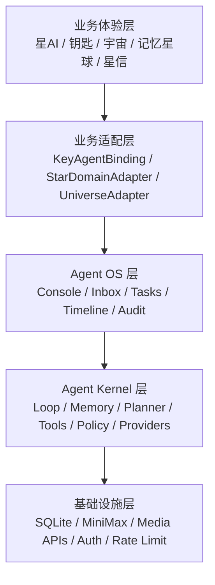
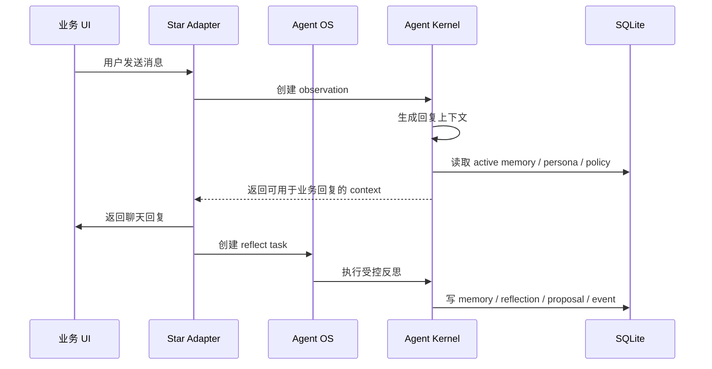
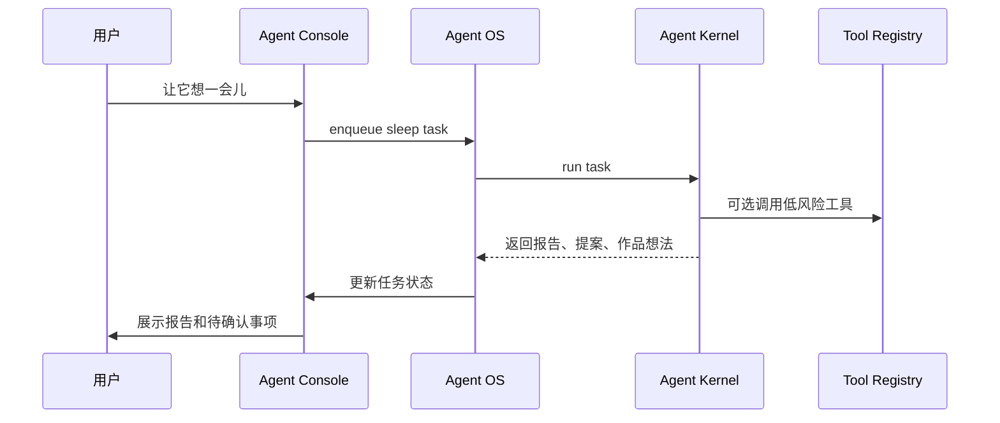
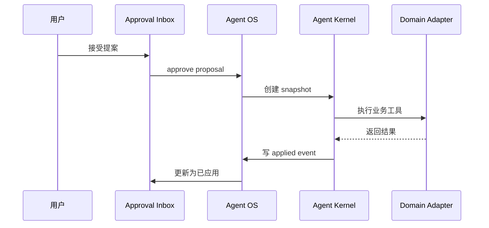

# Agent OS Layered Architecture Design

日期：2026-05-18

## 定位

本阶段把当前项目里的“星AI能力”下沉为通用 Agent 底层。

星AI、钥匙、宇宙、记忆星球、星信、公开主页都属于业务体验。它们不应该定义 Agent 的底层运行方式。

Agent 底层只负责通用能力：

- 观察输入。
- 组织上下文。
- 形成记忆。
- 反思和计划。
- 生成任务。
- 调用工具。
- 输出提案。
- 等待审批。
- 执行动作。
- 记录审计。
- 支持回滚。

一句话定义：

每个业务对象可以绑定一个或多个 Agent；Agent 作为底层运行系统存在，业务层只负责表达它、约束它、展示它。

## 外部参考

### Hermes Agent

参考项目：[NousResearch/hermes-agent](https://github.com/nousresearch/hermes-agent)

Hermes 的价值在于模块边界清晰：

- Core Agent 不绑定业务。
- Tool System 独立。
- Memory System 独立。
- Provider Abstraction 独立。
- Scheduler 独立。
- Skills 作为可复用能力包存在。

对本项目的启发：

- Agent Kernel 不应该依赖 MiniMax。
- 业务工具应该注册到 Tool Registry。
- 记忆、技能、模型、调度要分离。
- 星AI只是一个业务入口，不是 Agent 本体。

### OpenClaw

参考项目：[openclaw/openclaw](https://github.com/openclaw/openclaw)

OpenClaw 的价值在于运行控制：

- Agent 有运行时。
- 有命令队列。
- 有执行状态。
- 有上下文工程。
- 有安全沙箱。
- 有 gateway 和 runtime 分层。
- 支持实时控制、暂停、干预。

对本项目的启发：

- Agent 不只是聊天生成器。
- Agent 需要任务队列和运行状态。
- 影响用户体验的动作必须进入审批。
- 多 Agent 要通过 registry 和 routing 管理。
- 审计、权限、回滚属于底层能力，不属于 UI 补丁。

## 当前状态

当前项目已经具备这些能力：

- 一把钥匙对应一套隔离状态。
- 聊天后可以生成记忆、反思和进化提案。
- Agent Core 可以展示当前状态、睡眠周期、提案、历史和回滚。
- 记忆星球可以展示记忆、反思、提案、时间线和作品。
- `page_design` 提案可以生成设计预览。
- 作品可以在私有作品库里展示，并可手动公开。
- 公开宇宙可以展示公开智能体卡片和公开作品。

但当前实现仍偏业务聚合：

- `server/api/agent/*` 既是 Agent API，又包含 key 业务假设。
- `agent-learning.ts` 同时处理提示词、解析、治理和业务字段。
- `AgentCorePanel` 是业务 UI，但承担了 Agent 控制台概念。
- 记忆、作品、提案、睡眠还没有统一的任务和事件模型。
- MiniMax 调用还没有被抽象成 provider。
- 页面设计、媒体生成、公开作品还没有作为通用 tool 注册。

## 目标架构

目标分 5 层。



### 1. 业务体验层

这一层只关心用户看到什么。

包含：

- 星AI。
- 钥匙。
- 星信。
- 记忆星球。
- 星轨共写。
- 宇宙。
- 公开主页。
- 页面设计预览。

职责：

- 展示 Agent 状态。
- 触发业务动作。
- 接收用户确认。
- 把底层事件翻译成业务语言。

不做：

- 不直接写 Agent 学习逻辑。
- 不直接拼模型 prompt。
- 不直接决定记忆是否入库。
- 不直接执行影响系统状态的动作。

### 2. 业务适配层

这一层把业务对象绑定到底层 Agent。

建议核心概念：

```ts
type AgentOwnerType = 'key' | 'universe' | 'project'

type AgentBinding = {
  id: string
  agentId: string
  ownerType: AgentOwnerType
  ownerId: string
  domain: 'star'
  createdAt: string
}
```

第一阶段只需要 `ownerType = 'key'`。

适配层负责：

- 一把钥匙创建一个 Agent。
- 把 key profile 映射成 Agent persona。
- 把聊天消息映射成 Agent observation。
- 把页面设计、媒体生成、作品公开注册成 domain tools。
- 把 Agent artifact 映射成星信作品、页面设计、公开卡片。

适配层是业务和底层的唯一接缝。

### 3. Agent OS 层

这一层是 Agent 的操作系统。

它不等于星AI。星AI只是它的业务化入口。

Agent OS 提供：

- Console：控制台。
- Inbox：审批收件箱。
- Task Center：任务中心。
- Timeline：运行时间线。
- Audit Log：审计日志。
- Snapshot：回滚点。
- Policy Panel：权限和自动化边界。

Agent OS 负责回答：

- 当前 Agent 在什么状态。
- 它学到了什么。
- 它想做什么。
- 哪些动作等用户确认。
- 哪些任务失败了。
- 哪些结果可以回滚。

### 4. Agent Kernel 层

这是底层通用 Agent 能力。

核心模块：

```text
AgentLoop
AgentMemoryStore
AgentPlanner
AgentTaskQueue
AgentToolRegistry
AgentPolicyEngine
AgentProviderRegistry
AgentEventStore
AgentSnapshotStore
```

Kernel 不认识星AI、钥匙、宇宙。

Kernel 只认识：

- Agent。
- Session。
- Observation。
- Memory。
- Task。
- Tool。
- Proposal。
- Artifact。
- Event。
- Policy。
- Snapshot。

### 5. 基础设施层

这一层处理外部依赖。

包含：

- SQLite。
- MiniMax。
- 媒体生成 API。
- 鉴权。
- 限流。
- session。
- 日志。

第一阶段不引入新数据库，不引入后台 worker。

## 核心领域模型

### `Agent`

```ts
type Agent = {
  id: string
  status: 'active' | 'paused' | 'archived'
  persona: AgentPersona
  policy: AgentPolicy
  createdAt: string
  updatedAt: string
}
```

### `AgentObservation`

Agent 的输入事件。

来源可以是：

- 用户消息。
- 附件。
- 页面设计变更。
- 作品生成。
- 用户审批动作。
- 公开状态变化。

```ts
type AgentObservation = {
  id: string
  agentId: string
  sourceType: 'chat' | 'media' | 'design' | 'approval' | 'system'
  sourceId?: string
  content: string
  payload?: Record<string, unknown>
  createdAt: string
}
```

### `AgentMemory`

记忆是底层实体，不属于记忆星球。

记忆星球只是展示方式。

```ts
type AgentMemory = {
  id: string
  agentId: string
  type: string
  content: string
  importance: number
  confidence: number
  status: 'active' | 'archived' | 'rejected'
  sourceObservationId?: string
  createdAt: string
  updatedAt: string
}
```

### `AgentTask`

任务是 Agent 自主性的载体。

```ts
type AgentTask = {
  id: string
  agentId: string
  type:
    | 'reflect'
    | 'govern_memory'
    | 'propose_evolution'
    | 'generate_artifact'
    | 'preview_design'
    | 'publish_artifact'
  status:
    | 'queued'
    | 'running'
    | 'waiting_approval'
    | 'completed'
    | 'failed'
    | 'cancelled'
  inputJson: string
  resultJson?: string | null
  error?: string | null
  createdAt: string
  updatedAt: string
}
```

### `AgentTool`

工具是底层能力扩展点。

```ts
type AgentTool = {
  name: string
  description: string
  riskLevel: 'low' | 'medium' | 'high'
  approvalRequired: boolean
  execute(input: Record<string, unknown>): Promise<AgentToolResult>
}
```

业务能力以工具形式注册：

- `star.generateImage`
- `star.generateMusic`
- `star.generateVideo`
- `star.previewDesign`
- `star.commitDesign`
- `star.publishWork`
- `star.archiveMemory`

### `AgentProposal`

提案是等待确认的状态变更。

```ts
type AgentProposal = {
  id: string
  agentId: string
  taskId?: string
  type: string
  title: string
  summary: string
  payloadJson: string
  status: 'pending' | 'approved' | 'rejected' | 'applied'
  createdAt: string
  updatedAt: string
}
```

### `AgentArtifact`

作品、页面设计、公开卡片都可以抽象成 artifact。

```ts
type AgentArtifact = {
  id: string
  agentId: string
  type: 'letter' | 'image' | 'music' | 'video' | 'page_design' | 'profile_card'
  title: string
  summary: string
  previewUrl?: string | null
  payloadJson: string
  visibility: 'private' | 'public'
  sourceTaskId?: string
  sourceObservationId?: string
  createdAt: string
  updatedAt: string
}
```

## 运行流程

### 聊天后学习



### 自主任务



### 审批动作



## 权限边界

默认策略：

- 读上下文：允许。
- 生成记忆：允许，但可被治理。
- 生成反思：允许。
- 生成提案：允许。
- 改人格：需要确认。
- 改页面设计：需要确认。
- 公开作品：需要确认。
- 删除或拒绝记忆：需要确认。
- 调用外部发布能力：需要确认。

建议用 policy 表达：

```ts
type AgentPolicy = {
  autoLearn: boolean
  autoReflect: boolean
  autoRunLowRiskTasks: boolean
  requireApprovalForPersonaChange: boolean
  requireApprovalForDesignChange: boolean
  requireApprovalForPublishing: boolean
}
```

第一阶段不做复杂策略编辑器。先使用固定默认策略。

## 数据迁移策略

不建议一次性重写现有表。

第一阶段采用兼容式下沉：

- `keyId` 暂时继续作为 owner id。
- 新增 `agent_instances` 和 `agent_bindings`。
- 现有 `agent_states` 先增加 `agent_id` 或通过 binding 查询。
- 现有 `memories`、`agent_reflections`、`agent_evolution_proposals`、`agent_sleep_runs`、`agent_works` 暂时保留。
- 新增 `agent_tasks` 和 `agent_events`。
- 后续再把 `key_id` 主键迁移为 `agent_id`。

这样可以避免大范围破坏。

## API 分层

### 现有 API 保留

当前业务 API 保留：

- `GET /api/agent/core`
- `POST /api/agent/sleep`
- `PUT /api/agent/proposals/:id`
- `PUT /api/agent/memories/:id`
- `GET /api/agent/timeline`
- `GET /api/agent/works`
- `PUT /api/agent/works/:id`

它们继续服务现有 UI。

### 新增底层 API

新增 OS 风格 API：

- `GET /api/agents/current`
- `GET /api/agents/current/os`
- `GET /api/agents/current/tasks`
- `POST /api/agents/current/tasks`
- `PUT /api/agents/current/tasks/:id`
- `GET /api/agents/current/inbox`
- `POST /api/agents/current/inbox/:id/approve`
- `POST /api/agents/current/inbox/:id/reject`
- `GET /api/agents/current/events`

第一阶段可以让这些 API 复用现有 repository。

## UI 设计

### 星AI

星AI升级为业务化 Agent Console。

显示：

- Agent 状态。
- 当前人格。
- 学习模式。
- 睡眠周期。
- 待确认事项数量。
- 最近任务。
- 最近进化。
- 回滚点。

星AI不再塞进记忆星球。

### 决策收件箱

新增为星AI里的主视图。

内容类型：

- 记忆治理。
- 进化提案。
- 页面设计预览。
- 作品公开。
- 回滚确认。

### 任务中心

展示 Agent 自主任务。

每个任务显示：

- 类型。
- 状态。
- 输入摘要。
- 输出摘要。
- 是否需要确认。
- 失败原因。

### 记忆星球

记忆星球保持业务表达。

它读取 Agent memory、event、artifact，但不承担操作系统职责。

保留：

- 星球。
- 时间线。
- 作品。
- 记忆详情。
- 作品详情。

不放：

- Agent 控制台。
- 睡眠按钮。
- 提案审批主流程。

## 错误处理

底层统一错误类型：

- `provider_error`：模型或媒体服务失败。
- `tool_error`：工具执行失败。
- `policy_denied`：策略拒绝。
- `approval_required`：需要审批。
- `invalid_payload`：任务或提案 payload 无效。
- `stale_snapshot`：回滚快照不可用。

错误必须进入 `agent_events`。

UI 只展示短原因，不展示内部 payload。

## 隐私和安全

公开层只能读取显式公开内容。

禁止公开：

- key hash。
- session。
- IP hash。
- 完整对话。
- 私密记忆。
- 私密作品 payload。
- 原始模型返回。
- 工具输入中的敏感字段。

Agent event 可以保留私密审计信息，但只能在当前 key 的私有控制台查看。

## 测试策略

### 单元测试

覆盖：

- Agent binding 创建。
- Task 状态流转。
- Policy 判断。
- Tool Registry 注册和执行。
- Inbox approve / reject。
- Agent event 记录。
- 现有 key API 兼容。

### 组件测试

覆盖：

- 星AI显示 inbox 和任务状态。
- 记忆星球不渲染 Agent Console。
- 任务失败状态可见。
- 审批后状态更新。

### E2E

主流程：

1. 创建钥匙。
2. 进入聊天。
3. 打开星AI。
4. 执行一次自主思考任务。
5. 在收件箱里接受一个提案。
6. 打开记忆星球查看记忆和时间线。
7. 公开一个作品。
8. 在宇宙看到公开卡片。

## 分阶段交付

### Phase 1：分层命名和边界

- 新增 `agent_instances`、`agent_bindings`。
- 建立 key 到 agent 的 binding。
- 新增底层类型文件。
- 保持现有业务 API 不变。

### Phase 2：任务和事件

- 新增 `agent_tasks`。
- 新增 `agent_events`。
- 把 sleep run 包装成 task。
- 把提案审批写入 event。

### Phase 3：审批收件箱

- 新增 inbox 聚合 API。
- 星AI展示待确认事项。
- 记忆治理、提案、作品公开进入统一收件箱。

### Phase 4：Tool Registry

- 抽出工具注册层。
- 页面设计预览注册为 tool。
- 媒体生成注册为 tool。
- 作品公开注册为 tool。

### Phase 5：Provider 抽象

- 抽象 `AgentModelProvider`。
- MiniMax 作为默认 provider。
- 保留现有调用路径，逐步迁移。

## 非目标

本阶段不做：

- 多 Agent 协作。
- 后台 worker。
- 真正定时任务。
- 浏览器自动化。
- 文件系统 workspace。
- 第三方 provider UI 配置。
- 复杂策略编辑器。

这些能力以后可以基于 Agent Kernel 继续加。

## 成功标准

完成后，项目应达到以下状态：

- 业务层和 Agent 底层有清晰边界。
- 星AI只是 Agent OS 的业务入口。
- 钥匙只是 Agent owner，不是 Agent 本体。
- 记忆星球只展示 Agent 世界，不承担控制台职责。
- 自主思考以 task 形式存在。
- 所有重要动作有 event。
- 所有高风险动作进入 inbox。
- 后续可以扩展多 Agent，而不重写星空业务。

## 状态附录：2026-05-18 完成情况

### 已实现

- key 到 agent 的 binding。
- `agent_tasks` 和 `agent_events`。
- sleep run 进入 task/event 记录。
- 提案和作品公开审批进入 inbox。
- 星AI从记忆星球中拆出，作为 Agent 控制台入口。
- 公开宇宙只展示显式公开的星星和作品摘要。

### 本计划补完

- `agent_observations` 输入流。
- 统一事件类型和 OS 安全序列化。
- Agent provider registry。
- Star domain tool registry。
- 固定策略引擎。
- 同步 task queue / runner。
- `/api/agents/current`、tasks、inbox、events API。
- 记忆治理、等待审批任务、回滚候选进入 inbox。
- chat、design、media、approval、memory governance 写 observation/event。
- 高风险业务动作通过 Agent tools 执行。
- Agent Core 显示 OS 状态、任务动作和审计事件。
- OS/Core/Public 响应增加隐私契约回归测试。

### 仍属未来

- background worker。
- multi-agent collaboration。
- third-party provider UI。
- full physical `agent_id` migration。
