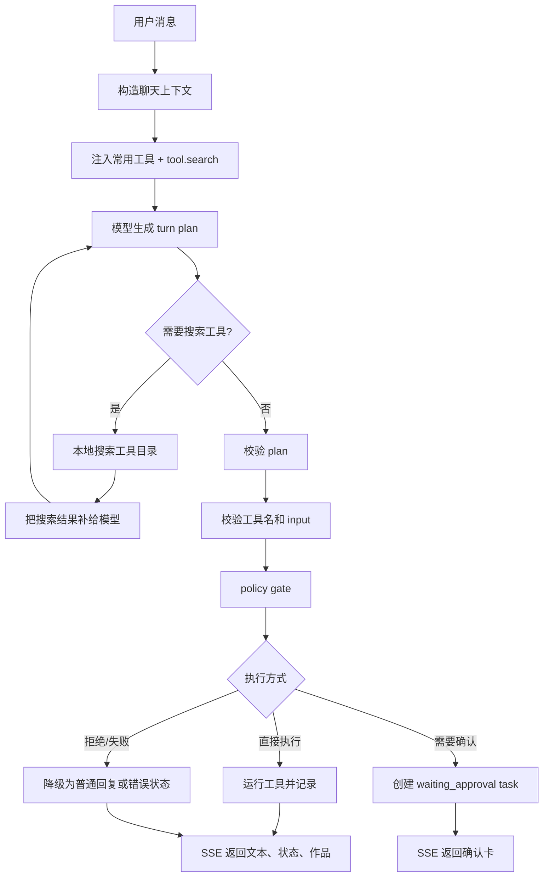

# Star Chat Tool Capability Design

日期：2026-05-19

> 后续自然语言工具规划以 `2026-05-19-natural-language-tool-planning-design.md` 和 `2026-05-19-natural-language-tool-planning-implementation.md` 为准。本文只保留早期能力设计背景。

## 背景

当前聊天已经支持文字、语音、图片、音乐、视频。

问题不在能力数量，而在能力进入对话的方式。

旧实现是：

- 前端 `StarComposer` 用按钮选择媒体模式。
- 后端 `chat-intent.ts` 用关键词把消息分到 `chat`、`audio`、`image`、`music`、`video`。
- `streamStarChatReply()` 根据 intent 直接分支执行。

当前实现已移除这层兼容路由。对话请求只携带 `message` 和 `attachments`，工具选择交给 planner、tool search、task queue 和 executor。

这套方式有三个问题。

第一，用户的真实意图不等于关键词。

“这段回忆像一张照片”可能适合图片，但不是明确生成命令。

第二，媒体只是能力的一部分。

后续还有记忆治理、作品发布、页面设计、整理报告、检索记录等能力。

第三，工具会越来越多。

如果每轮都把所有工具发给模型，上下文会膨胀，模型决策也会被噪音污染。

因此这里不继续强化“媒体 intent 路由”。

新的方向是：

对话模型拿到少量常用能力和一个 `tool.search` 能力。它先理解用户，再决定是否搜索工具、建议工具、或调用工具。后端负责校验、策略、确认、执行和记录。

## 现有基础

项目已经有可复用的 Agent OS 层。

- `server/services/agent-runtime.ts`
  - 已有 `AgentToolRegistry`
  - 已有 `AgentToolDefinition`
  - 已有 provider 抽象
- `server/services/star-agent-tools.ts`
  - 已有 `star.generateImage`
  - 已有 `star.generateMusic`
  - 已有 `star.generateVideo`
  - 已有 `star.previewDesign`
  - 已有 `star.commitDesign`
  - 已有 `star.governMemory`
  - 已有 `star.publishWork`
  - 已有 `star.sleep`
- `server/services/agent-policy.ts`
  - 已有 risk、approval、minor mode、memory topic 等策略
- `server/services/agent-task-queue.ts`
  - 已有 task 入队、运行、等待确认、完成、失败
- `server/services/agent-os.ts`
  - 已有 inbox 和 `task_approval`

所以不要新建一套确认系统。

聊天侧应该接入现有 registry、policy、task queue、inbox。

## 目标

把聊天从“intent 路由器”升级为“能力感知的对话代理”。

目标包括：

- 模型知道当前系统有哪些常用能力。
- 模型可以在需要时搜索工具目录。
- 模型输出结构化 turn plan，而不是单个 intent。
- 后端按 policy 决定执行、等待确认、拒绝或降级为普通聊天。
- 前端在聊天里展示工具状态、确认卡、作品结果。
- 星球待办和聊天确认使用同一份 task 状态。
- 工具增加时，不增加每轮对话的默认上下文负担。

## 非目标

第一阶段不做这些事：

- 不接入外部插件市场。
- 不依赖 provider 原生 function calling。
- 不让模型直接执行工具。
- 不让工具描述成为系统提示词。
- 不让高风险操作绕过现有 inbox。
- 不重写 Agent OS。
- 不重写媒体生成 API。

## 能力模型

工具定义从“可执行函数”扩展为“可被模型理解的能力卡片”。

建议类型：

```ts
export type AgentToolCategory =
  | 'reply'
  | 'media'
  | 'memory'
  | 'design'
  | 'publish'
  | 'system'

export type AgentToolBehavior =
  | 'present_reply'
  | 'create'
  | 'retrieve'
  | 'mutate'
  | 'publish'

export type AgentToolCard = {
  name: string
  title: string
  description: string
  category: AgentToolCategory
  behavior: AgentToolBehavior
  aliases: string[]
  whenToUse: string
  riskLevel: AgentToolRiskLevel
  approvalRequired: boolean
  inputSchema: Record<string, unknown>
}
```

`AgentToolRegistry.list()` 返回完整卡片。

聊天规划时只注入短卡片。

卡片只回答这些问题：

- 这个工具叫什么。
- 能做什么。
- 什么情况下用。
- 输入需要什么。
- 风险多高。
- 是否需要确认。

卡片不能携带长提示词。

## 语音能力的调整

当前 `audio` 被当作媒体 intent。

这不准确。

图片、音乐、视频是创作工具。

语音通常是回复呈现方式。

所以新增：

```ts
star.speakReply
```

含义：

把本轮最终文字回复转成语音。

它不是“生成一个音频作品”。

当用户说“读给我听”“用语音说”时，模型计划应该是：

```ts
{
  reply: '...',
  toolCalls: [
    {
      toolName: 'star.speakReply',
      input: { text: '$reply' },
      mode: 'execute',
      evidence: '用户明确要求语音回复。',
      reason: '将本轮回复转成语音。'
    }
  ]
}
```

后端在执行前把 `$reply` 替换为本轮最终回复。

## 常用工具

每轮对话默认只给 5 到 8 个常用工具。

建议第一批：

```ts
[
  'star.speakReply',
  'star.generateImage',
  'star.generateMusic',
  'star.generateVideo',
  'star.searchMemories',
  'star.searchWorks'
]
```

原因：

- 它们最容易在自然对话中触发。
- 它们覆盖“呈现回复”“生成作品”“查找上下文”三个常见动作。
- 它们不要求模型知道完整后台能力。

`star.searchMemories` 和 `star.searchWorks` 是低风险检索工具。

没有检索工具时，模型很难安全调用 `star.governMemory` 或 `star.publishWork`，因为它拿不到准确 id。

## tool.search

`tool.search` 是虚拟能力。

它不是业务工具。

它只查工具目录。

输入：

```ts
{
  query: string
  category?: AgentToolCategory
  behavior?: AgentToolBehavior
  limit?: number
}
```

输出：

```ts
{
  tools: AgentToolCard[]
}
```

限制：

- 每轮最多 2 次。
- 每次最多返回 5 个工具。
- 只搜索工具元数据。
- 不返回用户私有数据。
- 不执行工具。
- 结果只作为下一次 planner 输入。

搜索实现第一阶段用本地确定性打分。

打分字段：

- `name`
- `title`
- `description`
- `aliases`
- `whenToUse`
- `category`
- `behavior`

不需要向量库。

不需要额外模型调用。

## Turn Plan 协议

模型不返回 intent。

模型返回一份 turn plan。

```ts
export type StarChatTurnPlan = {
  reply: string
  toolSearches?: Array<{
    query: string
    category?: AgentToolCategory
    behavior?: AgentToolBehavior
  }>
  toolCalls?: Array<{
    toolName: string
    input: Record<string, unknown>
    mode: 'execute' | 'propose'
    evidence: string
    reason: string
  }>
}
```

字段语义：

- `reply` 是本轮给用户看的回复。
- `toolSearches` 是模型认为当前工具列表不够时提出的搜索。
- `toolCalls` 是模型认为应该执行或建议的能力。
- `mode: execute` 表示模型认为用户已明确授权。
- `mode: propose` 表示模型认为应该先征求用户确认。

后端不信任 `mode`。

后端会重新做 policy gate。

## 对话流程



## 执行策略

### 普通聊天

没有 `toolCalls` 时，只返回文字。

### 显式工具请求

例如：

- “画一张月光森林”
- “写一首歌”
- “做一段短片”
- “读给我听”

模型可以返回 `mode: execute`。

后端仍然用 policy 检查。

允许时直接执行。

### 隐含工具意图

例如：

- “这段像一张照片”
- “想把这种感觉留下来”
- “这句话很适合一首歌”

模型应该返回 `mode: propose`。

后端创建 `waiting_approval` task。

聊天里出现确认卡。

星球待办里出现同一条任务。

### 高风险动作

这些永远确认：

- 公开作品
- 删除或拒绝记忆
- 修改人格边界
- 提交设计
- 大范围数据删除

即使模型返回 `execute`，后端也会改成 `waiting_approval`。

### 不存在工具

模型调用不存在工具时：

- 不执行。
- 记录 provider 或 planner failure。
- 给用户普通回复。
- 不暴露内部错误。

### JSON 失败

规划 JSON 解析失败时：

- 降级为普通聊天流。
- 不触发工具。
- 不吞掉用户消息。

## SSE 事件

保留现有：

- `delta`
- `status`
- `message`
- `error`

新增：

```ts
type StarChatToolStatusEvent = {
  type: 'tool-status'
  text: string
}

type StarChatToolConfirmationEvent = {
  type: 'tool-confirmation'
  taskId: string
  inboxItemId: string
  title: string
  summary: string
}

type StarChatToolResultEvent = {
  type: 'tool-result'
  toolName: string
  result: Record<string, unknown>
}
```

最终 `message.parts` 可增加：

```ts
| { type: 'tool_status', text: string }
| { type: 'tool_confirmation', taskId: string, inboxItemId: string, title: string, summary: string }
| { type: 'work', workId: string, kind: 'image' | 'music' | 'video', title: string, previewUrl?: string }
```

如果第一阶段不做 `work` part，也可以先用 `status` 和确认卡。

## 存储和记录

直接执行的工具也应该进入 task 记录。

推荐流程：

- 创建 task。
- 立即调用 `createAgentLoop().runTask(task, { approvalGranted: true })`。
- 成功后把结果映射回聊天消息。

需要确认的工具：

- 创建 task。
- 调用 `runTask(task)`。
- policy 把它转成 `waiting_approval`。
- 聊天返回确认卡。

这样聊天确认和星球待办共用同一套数据。

## 前端体验

发送框不再强调模式选择。

媒体按钮保留，但变成快捷表达：

- 点图片按钮后发送，前端传明确工具请求。
- 不点按钮时，模型自行判断。

聊天区新增确认卡。

确认卡按钮：

- 批准：调用 `/api/agents/current/inbox/:id/approve`
- 拒绝：调用 `/api/agents/current/inbox/:id/reject`

批准后不需要新建另一套执行接口。

执行结果由现有 task/inbox/works 体系记录。

## 安全和隐私

必须保持这些边界：

- 工具搜索只返回工具元数据。
- 工具搜索不返回记忆、作品、聊天全文。
- 规划提示里不放 raw key、session、IP hash。
- 生成媒体 raw base64 不直接进入 task result。
- 对外响应继续经过 `sanitizeAgentResponseValue`。
- 高风险工具必须经过 policy。
- 未成年人模式继续阻断亲密人格定位。
- AI 生成作品继续带显式标识。

## 兼容层移除

旧的 `intent` 字段、`chat-intent.ts`、`streamStarChatReply()` 媒体直连分支、`imageDataUrl` 单字段、独立媒体 API 已移除。

不再存在：

```ts
intent -> forcedToolCall
/api/image
/api/music
/api/tts
/api/video/tasks
imageDataUrl
```

媒体生成必须经由工具目录、planner、task queue、executor。用户边界策略和审批语义只在这条链上生效。

## 设计主线

对话模型负责理解和规划。

工具目录负责能力发现。

policy 负责边界。

task queue 负责确认、恢复和记录。

tool registry 负责真实执行。

聊天 UI 只展示结果和待确认动作。
